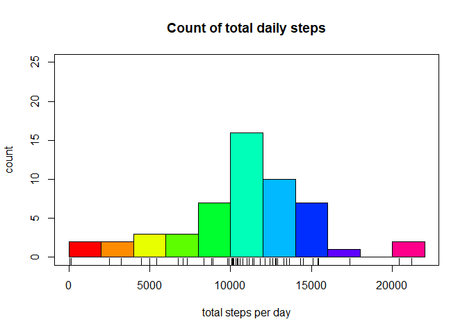
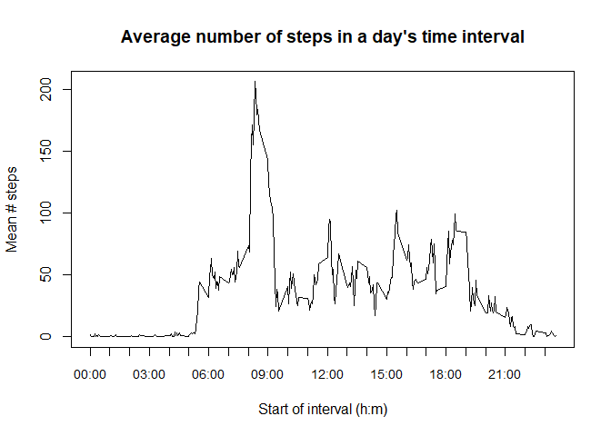
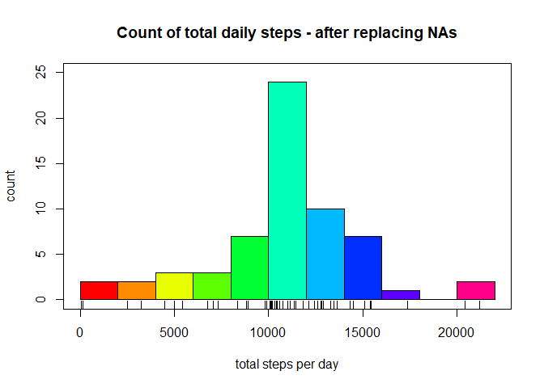
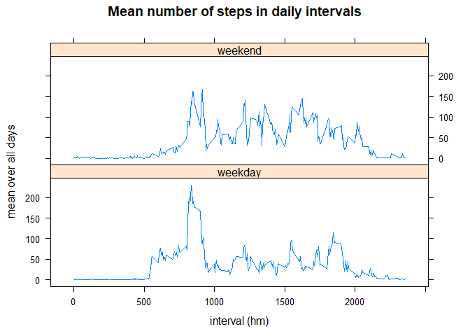

### Loading and preprocessing the data

The data set is found in a comma-separated file (csv), with header information in
the first row. Hence the "read.csv()" function is well suited to load the data.

By specifying the "na.strings" and "colClasses" arguments, preprocessing happens during the loading step.

```r
library(dplyr)

df <- read.csv("data/activity.csv", na.strings = "NA",
                 colClasses=c("integer", "Date", "integer")) %>%
      select("date", "interval", "steps")                          # reorder

str(df)
```

```
## 'data.frame':	17568 obs. of  3 variables:
##  $ date    : Date, format: "2012-10-01" "2012-10-01" ...
##  $ interval: int  0 5 10 15 20 25 30 35 40 45 ...
##  $ steps   : int  NA NA NA NA NA NA NA NA NA NA ...
```


### What is mean total number of steps taken per day?

This section investigates the total, average and median number of daily steps. Here "NA" values are excluded from the analysis.

```r
options(scipen=999, digits=0)
steps_byday <- tapply(df$steps, df$date, sum)

hist(steps_byday, breaks=10, col = rainbow(11),
     main="Count of total daily steps", xlab="total steps per day",
     ylim=c(0, 25), ylab="count")
rug(steps_byday)
box()
```

<!-- -->

```r
daily_mean <- mean(steps_byday, na.rm = T)
daily_median <- median(steps_byday, na.rm = T)
daily_mean; daily_median
```

```
## [1] 10766
```

```
## [1] 10765
```

The **average** (mean) number of daily steps is 10766 and the **median** is 10765, so these values lie very close to each other.


### What is the average daily activity pattern?

To investigate the pattern of daily activity first the required summaries are
generated.


```r
summ_ntv  <- group_by(df, interval) %>%
             summarize(mean = mean(steps, na.rm = T))

intv_asS <- sprintf("%04d", df$interval[1:288], "%H%M")
x_labels <- paste0(substr(intv_asS, 1, 2), ":", substr(intv_asS, 3, 4))                      
most_active <- x_labels[which.max(summ_ntv$mean)]
most_active
```

```
## [1] "08:35"
```

Therefore, the period in which on average most steps were made is 08:35.

Next the base plotting system is used to display a time series. A separate 
"axis" statement is used to create prettier x labels.


```r
by12 <- seq(1,288, by=12)

plot(summ_ntv$interval, summ_ntv$mean, type="l", xaxt = 'n', 
     main="Average number of steps in a day's time interval",
     xlab="Start of interval (h:m)",
     ylab="Mean # steps")
axis(1, at=summ_ntv$interval[by12], labels=x_labels[by12], cex.axis=0.9)
box()
```

<!-- -->


### Imputing missing values


```r
n_notComplete <- sum(!complete.cases(df))
n_notComplete
```

```
## [1] 2304
```

As can be deduced from above, the total number of rows with at least one NA is 2304.


The following strategy is used to remove the NA's in the steps column. 
If the steps of a particular interval are NA then it is replaced with the **mean**
across all days for *that* interval. This way the means of both:

1. total steps per day and
2. steps for that interval

stay unchanged.

In below code a new data frame is created with all NAs removed. After the imputation 
step the number of NA's is zero.

```r
df2 <- cbind(df)     # create a copy

na_rows <- is.na(df$steps)           # which are the NA rows? Logical vector
for (i in unique(df2$interval)){
    indices <- which(df2$interval==i & na_rows)
    df2[indices, "steps"] <- summ_ntv[summ_ntv$interval==i, "mean"]
}
sum(is.na(df2))      # how many NAs left?
```

```
## [1] 0
```
  
  
Below histogram shows the distribution of total daily number of steps taken.

```r
steps_byday2 <- tapply(df2$steps, df$date, sum)
hist(steps_byday2, breaks=10,  col = rainbow(11),
     main="Count of total daily steps - after replacing NAs",
     xlab="total steps per day",
     ylim=c(0, 25), ylab="count")
rug(steps_byday2)
box()
```

<!-- -->

Next mean and median of daily total steps are calculated, as before. 

```r
daily_mean2 <- mean(steps_byday2)
daily_median2 <- median(steps_byday2)
daily_mean2; daily_median2
```

```
## [1] 10766
```

```
## [1] 10766
```

The new daily **mean** is 10766, which is the same as before imputing the missing values. The new daily **median** is 10766, very close to the original 10765.

In general, the total daily number of steps will go up, as NAs were counted as zeros.

### Are there differences in activity patterns between weekdays and weekends?

First the data needs to be summarized in an appropriate way. 
A new variable "weekPart" is added to (a copy of) the imputed data frame; it will indicate
whether a day is a weekday or a weekend. For the lattice plotting function to work the "weekPart" variable must be of type factor.

```r
df3 <- df2 %>% 
       mutate(weekPart = ifelse(weekdays(date) %in% c("Saturday", "Sunday"), 
                                "weekend", "weekday")) %>%
       mutate(weekPart = as.factor(weekPart))

df3_summ <- group_by(df3, interval, weekPart) %>%
            summarise(mean=mean(steps))
```

Looking at the generated plots it seems that on workdays more steps are taken (on average) in the morning before 10 AM, whereas on weekends more steps are taken in the afternoon.


```r
library(lattice)
xyplot( mean ~ interval | weekPart, data=df3_summ, 
        type="l", layout = c(1, 2),
        main="Mean number of steps in daily intervals",
        ylab="mean over all days",
        xlab="interval (hm)")
```

<!-- -->

